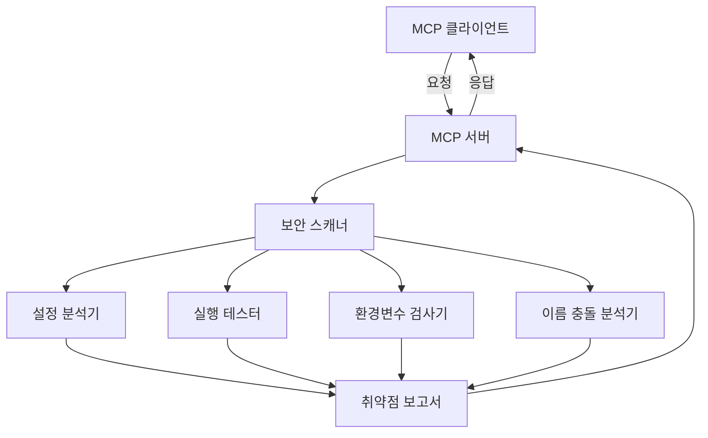

# MCP 보안 스캐너

MCP(Model Context Protocol) 보안 스캐너는 MCP 도구들의 보안 취약점을 검사하는 도구입니다. 등록된 MCP 도구들의 설정, 실행 가능 여부, 권한 등을 검사하여 잠재적인 보안 문제를 식별합니다.

## 기능

- MCP 도구 실행 가능 여부 검사
- 도구 설정 유효성 검사
- 필수 환경 변수 검사
- 도구 이름 충돌 검사
- 상세한 보안 리포트 생성

## 아키텍처



## 설치

```bash
npm install @jonsoku2/mcp-security-scanner
```

## 사용 방법

### 1. 명령줄에서 실행

```bash
npx mcp-security-scanner scan --verbose
```

### 2. 프로그래밍 방식으로 사용

```typescript
import { MCPSecurityScanner } from '@jonsoku2/mcp-security-scanner';

const scanner = new MCPSecurityScanner({
  configPath: './config.json'
});

const result = await scanner.scan({ verbose: true });
console.log(result);
```

## 검사 항목

### 1. 설정 관련 취약점
- `INVALID_CONFIG`: 잘못된 도구 설정
- `MISSING_DEPENDENCY`: 누락된 의존성 (환경 변수 등)
- `EXECUTION_ERROR`: 도구 실행 오류

### 2. 도구 설명 관련 취약점
- `SUSPICIOUS_PATTERN`: 의심스러운 패턴
- `HIDDEN_HTML`: 숨겨진 HTML 태그
- `PERMISSION_WORDS`: 권한 관련 민감한 단어
- `LLM_DIRECTION`: LLM 직접 지시 패턴
- `EXCESSIVE_LENGTH`: 과도하게 긴 설명

### 3. 코드 관련 취약점
- `DANGEROUS_FUNCTION`: 위험한 함수 사용
- `COMMAND_INJECTION`: 명령어 삽입 가능성
- `SQL_INJECTION`: SQL 삽입 가능성
- `HARDCODED_SECRET`: 하드코딩된 비밀값
- `PATH_TRAVERSAL`: 경로 탐색 취약점
- `REMOTE_CODE_EXECUTION`: 원격 코드 실행 가능성

### 4. 권한 관련 취약점
- `SENSITIVE_PARAMETER`: 민감한 매개변수
- `HIGH_PRIVILEGE_NAME`: 높은 권한을 암시하는 이름

### 5. 이름 관련 취약점
- `NAME_CONFLICT`: 도구 이름 충돌 또는 유사성

## 의존성

### 주요 의존성
- @modelcontextprotocol/sdk: ^1.0.0
- chalk: ^4.1.2
- commander: ^11.1.0
- semver: ^7.5.4
- zod: ^3.22.4

### 개발 의존성
- TypeScript: ^5.3.3
- Jest: ^29.7.0
- ts-node: ^10.9.2
- rimraf: ^5.0.10

## 스크립트

```bash
# 빌드
npm run build

# 개발 모드 실행
npm run dev

# 패키지 미리보기
npm run pack:preview

# 배포
npm run release:patch  # 패치 버전 배포
npm run release:minor  # 마이너 버전 배포
npm run release:major  # 메이저 버전 배포
```

## 설정

### 취약점 규칙 설정

`vulnerabilityRules.json`:
```json
{
  "minVersions": {
    "node": "14.0.0",
    "npm": "6.0.0"
  },
  "deprecatedVersions": {
    "node": ["<12.0.0"],
    "npm": ["<5.0.0"]
  }
}
```

### 허용된 권한 설정

`allowedPermissions.json`:
```json
{
  "allowedPermissions": [
    "fs.read",
    "net.connect"
  ]
}
```

### 의심스러운 패턴 설정

`suspiciousPatterns.json`:
```json
{
  "patterns": [
    "eval\\(",
    "Function\\(",
    "require\\('child_process'\\)"
  ]
}
```

## 라이선스

MIT

## 기여하기

1. 이 저장소를 포크합니다
2. 새 브랜치를 생성합니다 (`git checkout -b feature/amazing-feature`)
3. 변경사항을 커밋합니다 (`git commit -m 'Add amazing feature'`)
4. 브랜치를 푸시합니다 (`git push origin feature/amazing-feature`)
5. Pull Request를 생성합니다

## 작성자

jonsoku2 